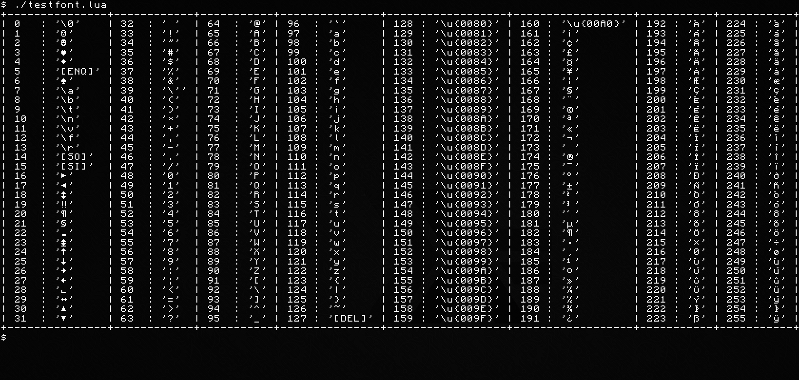
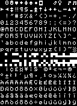

These are various scripts for generating `.pcf` fonts from `.bmp` images.

The original goal was to turn the [ComputerCraft](https://github.com/dan200/ComputerCraft) [term_font.png](https://github.com/dan200/ComputerCraft/blob/master/src/main/resources/assets/computercraft/textures/gui/term_font.png) file into a valid X11 font, although it can now be used to read and generate many fonts.

The scripts are written in [Lua 5.3](https://www.lua.org/manual/5.3/).

As of right now these scripts map the glyphs to Latin1 (ISO 8859-1),
 I might at some point look at mapping them to
 [Unicode](https://unicode-table.com/en/), so all characters are
 printable, e.g. mapping glyph 127 onto `U+2592` instead of `U+007F`
 (the `DELETE` character, which is of course not printable).

### Commands

```sh
# Remaking the `.pcf` files
lua ./bmp2pcf.lua term_font.bmp ccmono6x9r.pcf   --family CCMono --width 16 --padright 1 --padbottom 1
lua ./bmp2pcf.lua term_font.bmp ccmono12x18r.pcf --family CCMono --width 16 --padright 1 --padbottom 1 --scale 2 # Scale font to prevent anti-aliasing
# Installing the fonts (Ubuntu)
sh ./install.sh ccmono*.pcf
# Testing the font once installed (You might have to restart your application
#  and switch to the ccmono font first)
lua ./testfont.lua
# Uninstalling the fonts
sh ./uninstall.sh ccmono
```

### The bitmap (Generated from the original)


### Glossary
#### PSF
##### PC Screen Font
Binary file format used by Linux to efficiently load font ROMs into video memory (fixed width only)
#### PCF
##### Portable Compiled Font
Binary file format used by X11 to efficiently store bitmap fonts (fixed and variable width)
#### BDF
##### Glyph Bitmap Distribution Format
Text file format originally used by Adobe to define bitmap fonts (fully compatible with PCF)
